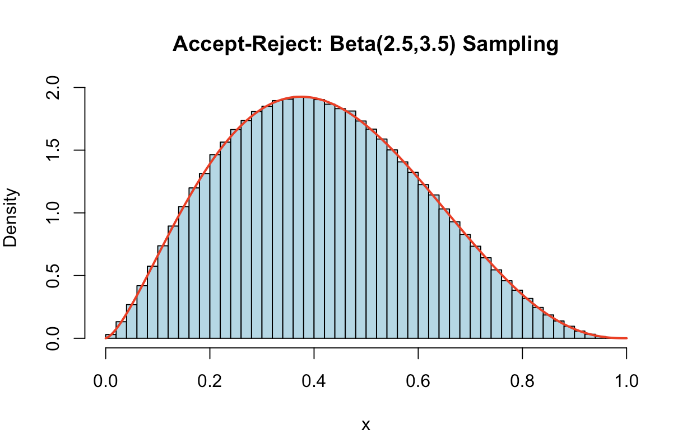

# Monte Carlo Sampling: Acceptance-Rejection Algorithm for Beta Distribution

This repository contains an R script (`Accept_Reject.R`) that provides a clear implementation of the **Acceptance-Rejection (A/R) Sampling** method, a foundational technique in Monte Carlo simulation for drawing random variates from complex or non-standard probability distributions.

The script specifically demonstrates how to sample from a **Beta Distribution** with parameters $\alpha=2.5$ and $\beta=3.5$ using a simple **Uniform Distribution** as the proposal function.

## 1. Acceptance-Rejection Principle

The Acceptance-Rejection method is used when the Inverse CDF method is not analytically possible or is too slow. It relies on finding a simpler, enveloping **proposal distribution** $g(x)$ such that $f(x) \le c \cdot g(x)$ for some constant $c$, where $f(x)$ is the target density.

### Key Implementation Steps:

1.  **Target Density ($$f(x)$$):** The Beta density function $\text{Beta}(\alpha=2.5, \beta=3.5)$.
2.  **Proposal Density ($$g(x)$$):** The Uniform density function $\mathcal{U}(0, 1)$, where $g(x) = 1$.
3.  **Constant $c$:** The script calculates the minimum constant $c$ such that $f(x) / g(x) \le c$. This $c$ represents the efficiency factor.
4.  **Sampling Loop:**
    * Sample $x$ from $g(x)$ (the Uniform distribution).
    * Sample $u$ from $\mathcal{U}(0, 1)$.
    * Accept $x$ if $u \le \frac{f(x)}{c \cdot g(x)}$.

## 2. Validation and Output

The script successfully generates $10^6$ samples and visually validates the results.

### Visual Validation

The script generates a plot showing:
1.  A histogram of the $1$ million generated samples (empirical distribution).
2.  The true theoretical Beta PDF (`dbeta`) overlaid as a red line, confirming the accuracy of the Acceptance-Rejection algorithm.

### Visual Validation

The following plot demonstrates the accuracy of the Acceptance-Rejection method: the histogram of the $1$ million generated samples perfectly matches the true theoretical Beta PDF (red line).



## 3. How to Run the Script

You need to have **R** installed on your system to run the analysis.

1.  **Save the file:** Ensure the code is saved as an R file (e.g., `Accept_Reject.R`).
2.  **Run the R script from your terminal:**

    ```bash
    Rscript Accept_Reject.R
    ```

### Dependencies

This script uses only base R functions, specifically `beta()` (for the Beta function) and `dbeta()` (for the PDF overlay), and requires no external packages.